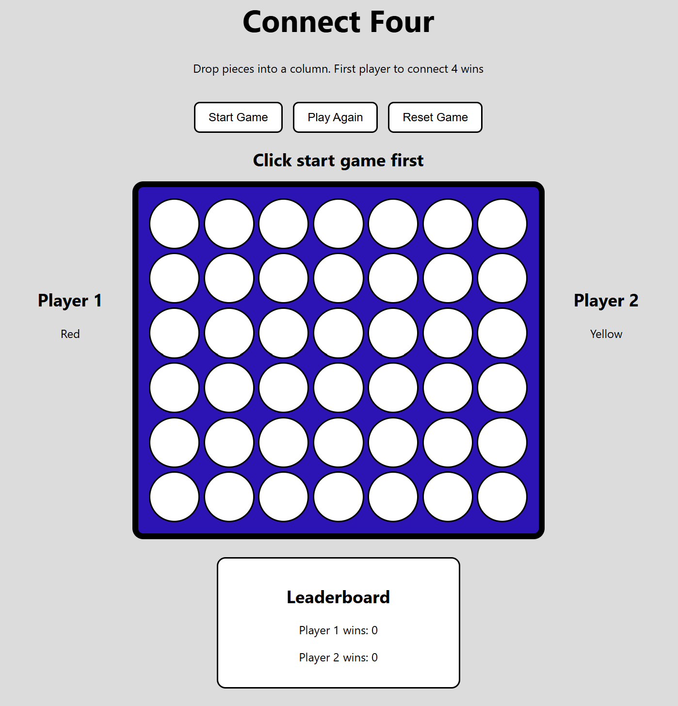

# Connect Four

This is my Connect Four game. It is a two-player game made with HTML, CSS, and JavaScript.

In the game, Player 1 is red and Player 2 is yellow. Each player takes turns dropping a piece into the board. The first player to connect four pieces in a row wins. The win can be vertical, horizontal, or diagonal.

I chose Connect Four because it is a simple game to understand, but it still has good logic for checking turns, wins, ties, and player scores.



## Getting Started

### Play the Game

[Deployed Game Link](https://jassiiimm.github.io/connect-four/)

### How to Play

1. Click Start Game to begin.
2. Player 1 uses red and Player 2 uses yellow.
3. Click on a column to drop your piece.
4. The first player to connect four pieces wins.
5. The win can be vertical, horizontal, or diagonal.
6. If the board is full and no one wins, it is a tie.
7. Click Play Again to clear the board and keep the score.
8. Click Reset Game to clear the board and reset the score.

### Installation

No installation is needed. You can clone the repository and open the `index.html` file in the browser.

```bash
git clone https://github.com/Jassiiimm/connect-four.git
cd connect-four
open index.html
```

## Technologies Used

HTML
CSS
JavaScript

## Future Enhancements

Add animation when the pieces drop.
Make the design better for smaller screens.

## Credits

Thanks to my GA instructor Nabila Ayaba, and my IAs Bidoor Almannaei and Zainab Fadhel for helping and giving feedback during the project.

## Contributing

This project was made for my Unit 1 project.

## License

No license added.